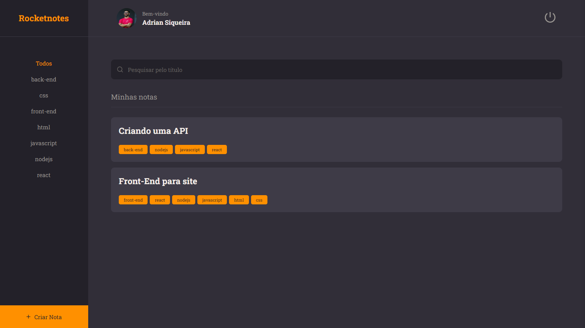

<h1 align="center"> RocketNotes </h1>

> Stage 09: Frontend - Explorer

<h2 id="project">📁 Projeto</h2>

Frontend do projeto RocketNotes, sua aplicação para salvar e gerenciar links úteis!

<h2 id="pages">📃 Páginas</h2>

A aplicação conta com páginas de login, cadastro, visualizar nota, perfil e criar nota.



<h2 id="features">🛠️ Funcionalidades</h2>

A aplicação apresenta as seguintes funcionalidades:

- Login;
- Cadastro;
- Mostrar perfil;
- Atualizar perfil;
- Cadastrar notas;
- Mostrar notas cadastradas;
- Filtrar notas;
- Mostrar detalhes da nota;
- Excluir nota;
- Logout.

<h2 id="technologies">💻 Tecnologias</h2>

Este projeto foi desenvolvido com as seguintes tecnologias:

- ViteJS;
- ReactJS;
- Styled Components;
- React Icons;
- React Router;
- Axios.

<h2 id="usage">💡 Utilização</h2>

A aplicação RocketNotes está disponível para utilização [aqui](https://rocket-notes-app.netlify.app/).

Você também pode instalá-la em sua máquina localmente. Para isso, clone o projeto, acesse a pasta, instale as dependências e inicie o servidor.

```
$ git clone https://github.com/AdrianSQS/Rocketnotes-Front
$ cd rocket-notes
$ npm install
$ npm run dev
```

⚠️ **Importante**: Este projeto está utilizando uma hospedagem gratuita para o seu backend, portanto, pode haver atrasos no tempo de resposta do servidor.

---

Feito por Adrian Siqueira 👋